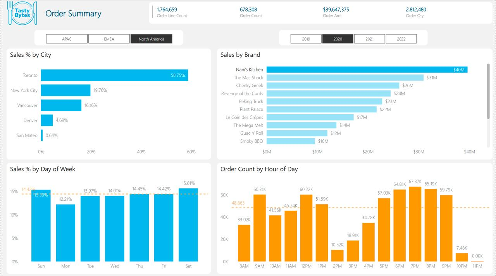
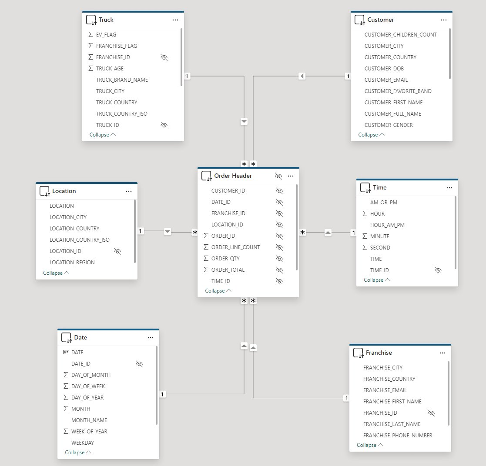
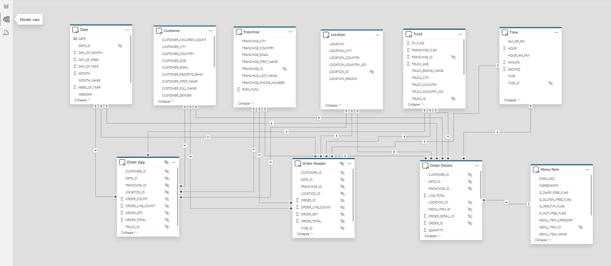

# Power BI Dashboards & Insights

The Power BI layer sits on top of the Snowflake star schema and focuses on three kinds of questions:

1. **Where are we selling?** (city / region / franchise)  
2. **When are we selling?** (date / weekday / time of day)  
3. **What is driving performance?** (trucks, menu items, customer segments)

---

## Order Summary Dashboard

This is the main **Order Summary dashboard** built in Power BI.  
It includes KPI cards (Order Count, Order Qty, Revenue), region slicers,  
Sales % by City, Sales by Brand, Day-of-Week patterns, and Hour-of-Day order trends —  
all powered by the `DT_FACT_ORDER_AGG` table.

From this visual you can quickly see:

- How **sales distribution** shifts across global regions (APAC, EMEA, North America)
- The **top cities** and how much they contribute to total order volume
- Which **brands** dominate revenue and how they compare side-by-side
- Weekly demand patterns, showing which **days of the week** have the highest activity
- Clear **hour-of-day peaks**, highlighting lunch and evening rush periods
- Whether demand is spread across time or concentrated in specific peak windows

---

## Model Behind the Dashboards

The model connects `DT_FACT_ORDER_AGG` to the dimensions:

For more detailed views (e.g. product-level analysis), the extended model also brings in `Order Details` and `Menu Item`:

---

## Example Insights

A few examples of insights this model can deliver (these will depend on the actual data, but this is the kind of analysis I designed it for):

1. **City performance:**  
   - Identify top-performing cities by `order_total` and `order_count`.  
   - Compare city share in EMEA vs North America.

2. **Time-of-day patterns:**  
   - Use `dim_time` and `dim_date` to see peak hours and weekdays.  
   - Separate weekday lunch rush from weekend evening spikes.

3. **Franchise analysis:**  
   - Rank franchises by total revenue and order volume.  
   - Spot underperforming franchises in otherwise strong cities.

4. **Truck-level trends:**  
   - Measure performance of EV vs non-EV trucks (`ev_flag`).  
   - Understand which truck brands and ages perform best.

5. **Customer behaviour:**  
   - Use `dim_customer` to see which countries and cities generate most demand.  
   - Segment by demographics (where available) to plan targeted campaigns.

---

## Why this matters for analytics work

This setup isn’t just a pretty dashboard:

- The **data model** is built to support flexible slicing and drilling.  
- Snowflake’s **dynamic tables** keep the data current with minimal maintenance.  
- Power BI is configured to sit on top of a **clean semantic layer**, not messy raw tables.

The combination shows how I think about analytics end-to-end: from schema to query to visual to insight.
