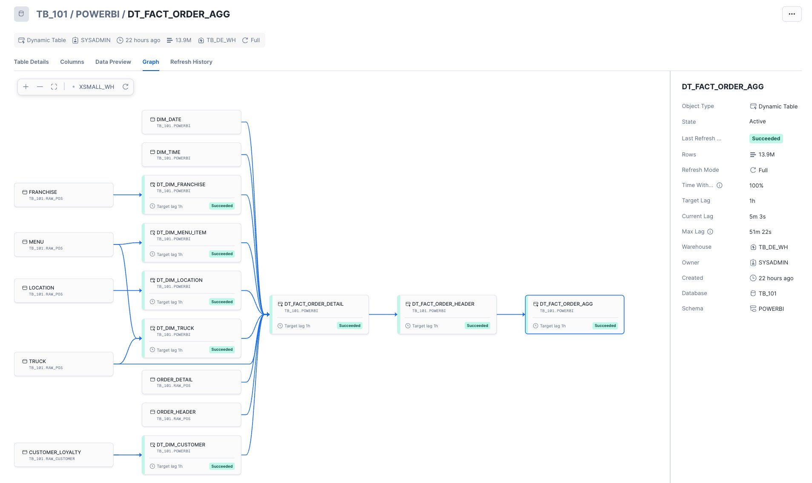
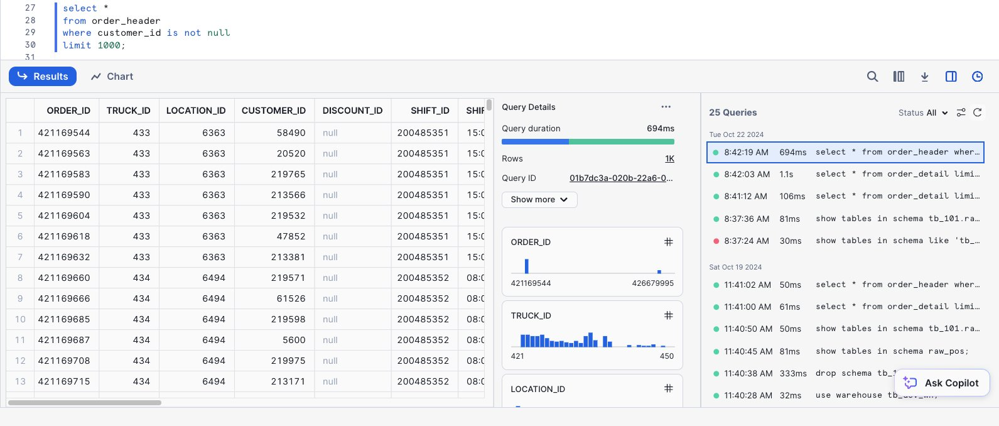

# Snowflake ETL & Dynamic Table Pipeline

This page explains how the data flows from raw marketplace tables to the analytics-ready star schema used by Power BI.

---

## Source: Snowflake Marketplace – Tasty Bytes

The project starts by importing the **Tasty Bytes** dataset from Snowflake Marketplace into a database (e.g. `TB_101`). Raw tables include:

- `FRANCHISE`
- `TRUCK`
- `LOCATION`
- `MENU`
- `CUSTOMER_LOYALTY`
- `ORDER_HEADER`
- `ORDER_DETAIL`

Initial profiling and exploration are done using `1 - Data Profiling.sql`.

---

## Layers

### 1. Raw / Landing

Marketplace tables are kept mostly as-is in a **RAW_POS** schema. This keeps a faithful copy of the vendor’s structure.

Scripts used:

- `2 - Marketplace Data.sql` – sets up schemas, grants, and any basic clean-up or type fixes needed.

---

### 2. Dimensional Layer – Dynamic Tables

Dynamic tables in Snowflake are used to build the dimensional layer. They materialise views on top of RAW tables and keep them fresh automatically.

Example lineage:

Key dynamic tables:

- `DT_DIM_DATE`
- `DT_DIM_TIME`
- `DT_DIM_FRANCHISE`
- `DT_DIM_MENU_ITEM`
- `DT_DIM_LOCATION`
- `DT_DIM_TRUCK`
- `DT_DIM_CUSTOMER`

Each dynamic table:

1. Selects from the relevant raw table  
2. Cleans column names and types  
3. Adds surrogate keys where needed  
4. Ensures one row per business entity (truck, customer, etc.)

These definitions are captured in `3 - Create a Star Schema.sql`.

---

### 3. Fact Layer – Orders

Two levels of facts are created:

1. **Order detail** (`DT_FACT_ORDER_DETAIL`)  
   - Includes quantities, prices, and menu items.  
2. **Order header** (`DT_FACT_ORDER_HEADER`)  
   - One row per order with high-level values.

Then an **aggregated fact** is created:

- `DT_FACT_ORDER_AGG` – aggregated by customer, truck, location, date, time, and franchise.

This table is the main fact feed for Power BI.

---

### 4. Data Governance & Performance

`4 - Data Governance.sql` sets up:

- Logical separation of schemas (RAW, POWERBI, etc.)  
- Role-based access to limit who can query what  
- Warehouses (e.g. `TB_DE_WH`, `XSMALL_WH`) for different workloads  

Query profiling is used to confirm performance:

The dynamic tables are configured with appropriate refresh lag (e.g. 1 hour) so the **POWERBI** schema stays up to date without manual refresh jobs.

---

## 5. Exposure to Power BI

The final **POWERBI** schema contains:

- `DT_DIM_*` tables  
- `DT_FACT_ORDER_DETAIL`  
- `DT_FACT_ORDER_HEADER`  
- `DT_FACT_ORDER_AGG`

Power BI connects directly to this schema (DirectQuery or Import), and the model in Power BI uses relationships based on surrogate keys (e.g. `date_id`, `time_id`, `customer_id`).

The end result is a clean, governed data model optimised for analytics.
